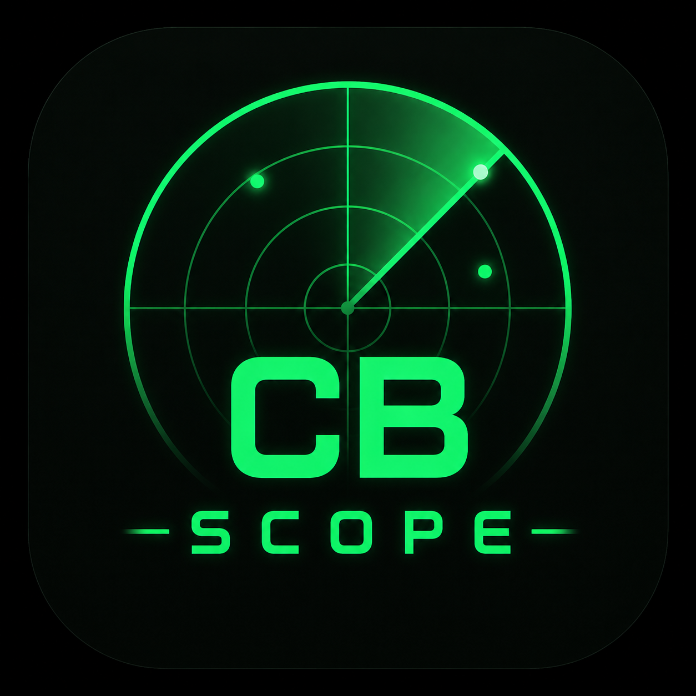

# CBScope

**A modern WSJT-CB companion — live map, logbook, and propagation dashboard for 11 m CB FT8 operators.**

Streams decodes and QSOs live from WSJT-CB over UDP, tails your ADIF log for automatic imports, and enriches everything with grid lookups, propagation snapshots, and an interactive world map. Also works with WSJT-X on amateur bands.

<p align="center"></p>

## Features

**Live**
- Real-time decode stream from WSJT-CB on UDP 2237
- Status pane with band, mode, DX target, TX/RX offsets
- Solar / propagation strip (SFI, K, A, sunspots) with band-quality hints
- Auto-detects your callsign & grid from WSJT-CB Status — no manual setup

**Map**
- Live decodes as fading dots with SNR / distance / mode tooltips
- Logged QSOs coloured by equipment, with an on-demand signal heatmap per radio/antenna and a dB legend
- **Running-QSO overlay**: `Calling → Working` state driven by WSJT-CB Status + directed decodes, plus a **Calling-CQ halo** on your QTH while transmitting a CQ
- PSK Reporter spot dots + animated great-circle traffic (Mercator-correct)
- Greyline overlay, time-replay scrubber, retro / OSM tile styles

**Review**
- Every auto-imported QSO lands in a review queue
- Add radio / antenna / notes / rating; edit or auto-fill the grid locator
- Missing grid resolves via PSK Reporter and back-fills the row automatically

**Logbook**
- Searchable, filterable table (review state, rating, equipment)
- Delete QSOs with confirmation
- ADIF drag-drop import and export

**Stats**
- KPIs (QSOs, unique calls / grids / countries)
- QSO/day chart, distance polar chart
- Per-equipment performance table (QSOs, grids, countries, avg / best DX, avg RST)

## Quick start

1. Grab `CBScope.dmg` from the [releases page](../../releases) and drag `CBScope.app` into `/Applications`. Releases are signed with an Apple Developer ID and notarized, so Gatekeeper will let it open without ceremony.
2. In **WSJT-CB → File → Settings → Reporting**, enable *UDP Server* pointed at `127.0.0.1:2237`.
3. In **CBScope → Settings**, check the WSJT-CB ADIF log path (a sane OS default is pre-filled) — new QSOs will land in the *Review* tab as WSJT-CB writes them.
4. Enter your callsign + grid (or wait for the first WSJT-CB Status packet to fill them in).

That's it — click over to *Live* or *Map* and start decoding.

## Build from source

```bash
flutter pub get
flutter run -d macos             # or -d windows / -d linux
flutter build macos --release    # unsigned .app under build/macos/...

# Signed + notarized DMG (requires Developer ID cert + notarytool profile):
./scripts/release_macos.sh
```

Requires Flutter 3.22+. On macOS, Xcode 14+ for release builds. The release
script's prerequisites are documented at the top of the file.

## Data & privacy

Everything is stored **locally** in an SQLite database under the OS app-support directory. No account, no telemetry, no upload. Callsign→grid lookups hit [PSK Reporter](https://www.pskreporter.info) directly; propagation numbers come from [hamqsl.com](https://www.hamqsl.com). Both are toggleable in Settings.

## Stack

Flutter · Riverpod · Drift (SQLite) · flutter_map · WSJT-X UDP protocol (schemas 2 & 3).

## License

MIT
